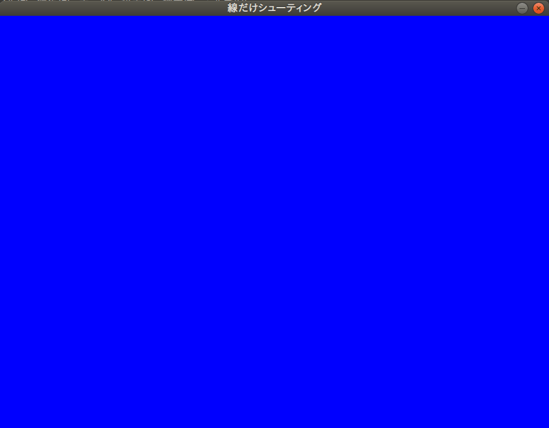
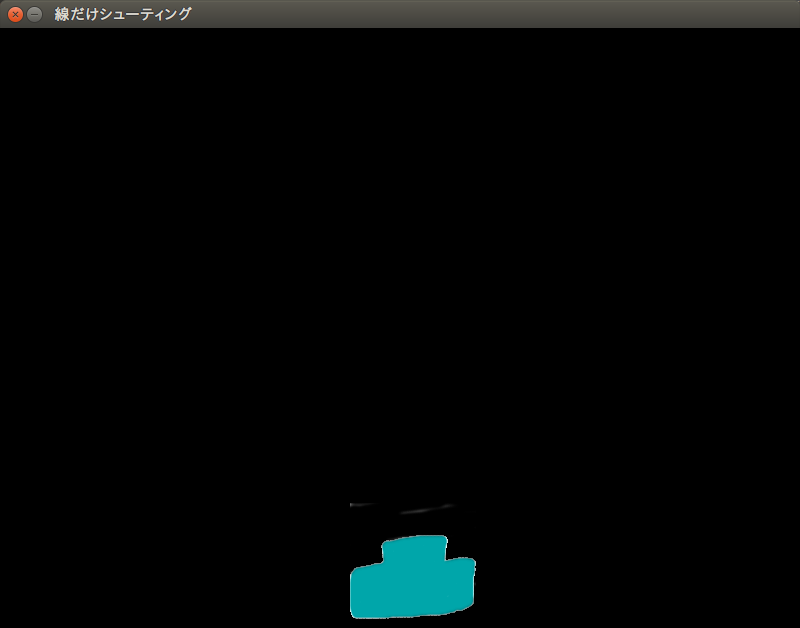

========================================================
Pythonでゲームを作りますが、何か of Python3
========================================================

目的
===============

簡単なシューティングゲームを作って、Pythonに馴染んてもらう。

.. note::
 元ネタは `Pythonでゲーム作りますが何か？ - 人工知能に関する断創録`_ です。

.. warning::
 この資料はPythonの基本文法をすっ飛ばしていますので、Pythonの基本文法に関しては、
 `Dive into Python3`_ もしくは `Pythonチュートリアル`_（こちらのほうが詳しいです） をお読みいただけると幸いです。

 またこのKataではコマンド操作を必要としますので、最低限以下のコマンド操作を伝授させてください。

 + cd （ディレクトリ移動(Windowsでは引数なしの場合、現在ディレクトリのパス表示)）
 + dir （現在ディレクトリの内容を表示）
 + pwd （macOS, Linuxの場合の現在ディレクトリのパス表示）
 + ls （macOS, Linuxの場合の現在ディレクトリの内容を表示）

.. tip::
 伝授する際のコツは、書くキーワードがScratchなどの何に対応するのかを伝えながらだと、わかりやすいかもしれません。

.. _`Pythonでゲーム作りますが何か？ - 人工知能に関する断創録`: http://aidiary.hatenablog.com/entry/20080507/1269694935
.. _`Dive into Python3`: http://diveintopython3-ja.rdy.jp/
.. _`Pythonチュートリアル`: http://docs.python.jp/3/tutorial/

用意するもの
=============

+ Python3 (Windows, Mac, Linux)
+ Pygame
+ Pythonのソースコードが編集できるエディタ（Atom推奨。PyCharmでも可）
+ （できれば）ゲームに使う画像・音楽素材。

カリキュラム（？）
========================

環境構築
++++++++++++

Python3
------------

1. Python自体をインストールします。

  Windows Mac

    公式サイトから適切なインストーラーをダウンロード。

  Linux(Ubuntu 16.04)

    以下コマンド実行。::

      sudo pip3 install pygame

  もし何か問題があればエラーメッセージを見て解決してください。大抵「pip3が入っていない」、
  「管理者権限で動かしていないためインストールできない」などが多いです。

2. コマンドプロンプト・もしくはターミナルで以下を実行してください。 ``Python 3.x.y`` と表示されたら成功です。::

    python -V
    python3 -V

Atom
-----------

1. Atom_ 本体をダウンロードします。

.. _Atom: https://atom.io/

2. Atomのインストールが終わったら、Atomで以下のパッケージをダウンロード・インストールします。
   好みで他のパッケージを入れたり、逆に抜いたりしてください。

 + japanese-menu
 + file-icons
 + atom-beautify
 + tabs-to-spaces
 + highlight-selected
 + term3（できれば）
 + autocomplete-paths
 + autocomplete-python
 + symbols-tree-view

PyCharm Community Edition(任意)
---------------------------------------

もっと高性能なエディタ（IDE）が良いということであれば、 PyCharm_ をおすすめします。
しかし、UIが英語限定です。

.. _PyCharm: http://www.jetbrains.com/pycharm/

気をつけていただきたいのが、 *Professional Edition*　は有料のため、 *Community Edition* を
選択してください。

やってみよう
++++++++++++++++

では実際にゲームを作っていきましょう。

画面を表示する
------------------

.. code-block:: python

 import pygame
 from pygame.locals import *
 import sys

 SCREEN_SIZE = (800, 600) # スクリーンサイズ(px指定)

 # Pygame初期化
 pygame.init()
 # SCREEN_SIZEの画面作成
 screen = pygame.display.set_mode(SCREEN_SIZE)
 # タイトルバーの文字列セット
 pygame.display.set_caption("プチプチシューティング")

 # ゲームイベントループ
 while True:
  screen.fill((0, 0, 255)) # 画面を真っ青で塗りつぶす。
  pygame.display.update() # 画面を更新
  # イベント処理
  for event in pygame.event.get():
      if event.type == QUIT: # 終了イベント
         sys.exit()

このコードを書いたら、名前を ``game.py`` として保存し、コマンドでファイルの保存したディレクトリまで移動して、
``python game.py`` と実行してみましょう。

この画面が出てきたら正解です。
しかし真っ青な画面は目が痛くなるので、真っ黒な画面にしましょう。

.. hint::
   + *fill* というのは「塗る」という意味です。
   + コンピューターでは基本的に、赤・緑・青の光の三原色で色を記録します。
   + 勇気のあるNinjaは、上のソースコードの以下の部分を消して実行してみよう！　しかし危険が伴うぞ！::
       for event in pygame.event.get():
           if event.type == QUIT: #終了イベント
               sys.exit()

.. danger::
   「ヒント」の一番最後は、プログラムを終了させなくする技なので、Mentorの皆様、および先輩Ninjaは
   強制終了の方法を伝えておくこと。

.. note::
   importってなんですか？
     ライブラリやモジュールというものを読み込んでいます。ライブラリというのは、簡単に言えば説明書です。
     説明書を渡して、いまあなたが触っているPythonという言語が、画面を表示したりする方法を会得しています。
     また、モジュールというのは、別のプログラムのことを言います。プログラムはバラバラに分解して作ることが
     できるんですよ。

スプライトを作る
-------------------------

それでは画面を真っ黒にできたら、画面に表示するキャラクターのスプライトを作りましょう。

.. note::
 スプライトという単語で反応したNinjaは、なかなかのScrach使いとみた。

といっても簡単で、素材ファイルがあれば以下の行を追加するだけです。

.. code-block:: python

 # 背景透過が必要ないとき
 pc_img = pygame.image.load("読み込みたいイメージファイル").convert()

 # 背景透過が必要なとき
 pc_img = pygame.image.load("読み込みたいイメージファイル").convert_alpha()
 # 背景色を指定していても、背景が透明にならない場合について
 pc_img = pygame.image.load("読み込みたいイメージファイル").convert()
 colorkey = pc_img.get_at((0, 0)) #左上の色を透明色に
 pc_img = set_colorkey(colorkey, RLEACCEL)

ここでは以下の素材を使いましょう。

それでは、 ``game.py`` を以下のように書き換えましょう。

.. code-block:: python

 import pygame, math
 from pygame.locals import *
 import sys

 SCR_RECT = Rect(0, 0, 800, 600) # スクリーンサイズ(px指定)

 # キャラクターのスプライト（クラス）を作る
 class CharacterSprite(pygame.sprite.Sprite):
     def __init__(self, filename, x, y, vx, vy):
         pygame.sprite.Sprite.__init__(self)
         self.image = pygame.image.load(filename).convert_alpha()
         width = self.image.get_width()
         height = self.image.get_height()
         self.rect = Rect(x, y, width, height)
         self.vx = vx
         self.vy = vy

     def update(self):
         # 画面からはみ出ないようにする
         self.rect = self.rect.clamp(SCR_RECT)
     def draw(self, screen):
         screen.blit(self.image, self.rect)

 if __name__ == '__main__':
     pygame.init()
     screen = pygame.display.set_mode(SCR_RECT.size)
     pygame.display.set_caption("プチプチシューティング")

     # スプライト作成
     MyPC = CharacterSprite("pc_img.png", 400, 500, 100, 100)

     # 画面の更新時間を管理するオブジェクト
     fps = pygame.time.Clock()

     # ゲームイベントループ
     while True:
         screen.fill((0, 0, 0))
         fps.tick(60)

         # スプライト更新
         MyPC.update()

         # スプライトを描画
         MyPC.draw(screen)

         pygame.display.update() # 画面を更新

         # イベント処理
         for event in pygame.event.get():
             if event.type == QUIT: # 終了イベント
                 sys.exit()

難しいことは抜きにすると、class（クラス）というのはScratchでいうところの *スプライト* 、
プログラミンでいうところの *絵* です。
そしてdefという単語で始まっているのは **メソッド** と呼ばれるもので、これはScratchの
*ブロックを作る* に近いです。

さて、実行するとこんな画面が出てくると思います。

| 「しかし面倒な書き方してるなあ」
| そう思ったNinjaは、後々この書き方をしていてよかったと思えるようになるはず。

「俺はこれから本気出す」 - プレイヤー・キャラクター、動く。
--------------------------------------------------------------------------

さて、せっかく出した画像なので、動かしたいですよね。できれば自分の思ったとおりに。

もちろんゲームなので、キーボードに反応して動いてくれないとつまらないですね。
ということでここからはそれを作っていきます。

同じく ``game.py`` を以下のように書き換えましょう。

.. code-block:: python

 import pygame, math
 from pygame.locals import *
 import sys

 SCR_RECT = Rect(0, 0, 800, 600) # スクリーンサイズ(px指定)

 # キャラクターのスプライト（クラス）を作る
 class CharacterSprite(pygame.sprite.Sprite):
     def __init__(self, filename, x, y, vx, vy):
         pygame.sprite.Sprite.__init__(self)
         self.image = pygame.image.load(filename).convert_alpha()
         width = self.image.get_width()
         height = self.image.get_height()
         self.rect = Rect(x, y, width, height)
         self.vx = vx
         self.vy = vy

     def update(self):
         # 画面からはみ出ないようにする
         self.rect = self.rect.clamp(SCR_RECT)
     def draw(self, screen):
         screen.blit(self.image, self.rect)

 # プレイヤーのスプライト（クラス）を作る
 class PCSprite(CharacterSprite):
     def move(self, press):
         if press[K_LEFT]:
             self.rect.move_ip(-self.vx, 0)
         if press[K_RIGHT]:
             self.rect.move_ip(self.vx, 0)
         if press[K_UP]:
             self.rect.move_ip(0, -self.vy)
         if press[K_DOWN]:
             self.rect.move_ip(0, self.vy)

 if __name__ == '__main__':
     pygame.init()
     screen = pygame.display.set_mode(SCR_RECT.size)
     pygame.display.set_caption("プチプチシューティング")

     # スプライト作成
     MyPC = PCSprite("pc_img.png", 400, 500, 100, 100)

     # 画面の更新時間を管理するオブジェクト
     fps = pygame.time.Clock()

     # ゲームイベントループ
     while True:
         screen.fill((0, 0, 0))
         fps.tick(60)

         # スプライト更新
         MyPC.update()

         # スプライトを描画
         MyPC.draw(screen)

         pygame.display.update() # 画面を更新

         # イベント処理
         for event in pygame.event.get():
             if event.type == QUIT: # 終了イベント
                 sys.exit()
             if event.type == KEYDOWN:
                 if event.key == K_ESCAPE:
                     sys.exit()
                 pressed_keys = pygame.key.get_pressed()
                 MyPC.move(pressed_keys)

はい！　ここでまどろっこしい書き方がさらにまどろっこしくなった様に見えるけど、
``PCSprite`` という新しいクラスを作りました。

| 「おや？　新しいクラスを作ったのなら、画像を表示するための処理を書かなくていいの？」
| って思ったNinja、鋭い。

| ``PCSprite`` の後ろに ``(CharacterSprite)`` と書いていますね。これは
| 「CharacterSpriteの機能をクローンします」
| という指示になります。これ、難しい言葉で言うと **継承（けいしょう）** って言います。

そして、イベント処理のところにキーボードの情報を受け取るようにして、更に ``PCSprite``　を
ベースに作った ``MyPC`` の ``move``　メソッドに、どのキーボードが押されているかを
送っています。　送られたキーボードの情報は、 ``MyPC`` の ``move`` は ``PCSprite`` の
``move`` と同じ動き（ただしデータは *MyPCが持っているデータ* ） をするので、キャラクターが動く
という仕組みです。

ちょっとむずかしかったかな。

.. attention::
    実はここまで書いておいて申し訳ないのですが、このコード、正しくないです。

    なんで書いたかというと、簡単なPythonのイントロダクションも兼ねて筆者がまっさらなところから書きました。
    ということで次の章からガラリとコードが変わるので、ご容赦ください。

「こいつ、動くぞ？！」 - 敵を表示させて動かしてみる。
--------------------------------------------------------------

大半のゲームには何らかの課題が在ります。モンスターを倒したり宇宙人を侵入させないようにしたり。
ということで敵を出しましょう。

あっ！　重要なことを忘れてた！　ゲームにはルールが必要です。
ということで今ここでこのゲームのルールを決めちゃいましょう！　いやー、危なかった。

+ プレイヤーは画面下に向かって行く敵をひたすら倒す。
+ 弾は真上にしか打てない
+ 敵とプレイヤーキャラクターがぶつかったらゲームオーバー
+ 敵を画面下から3回通してしまってもゲームオーバー
+ 敵は気まぐれなので下方向に一直線に進まない
+ 敵の倒して得点がもらえる

ということで、ここでは敵を動かすついでに、ぶつかった時の処理を書きましょう。

さてさて、ここでソースコードが大きく変わりますよ。
筆者も本気出すよ。

.. code-block:: python

あとがき
======================

実はPythonでゲームを作ったのは今回が初めてです。
なので、最初のソースコードと最後に出来上がったソースコードが全く違うものになっていると思います。

でもそれでいいと思います。
そんな最初からいきなり綺麗なコードをかける人がいたら、それは設計者か神様です。
