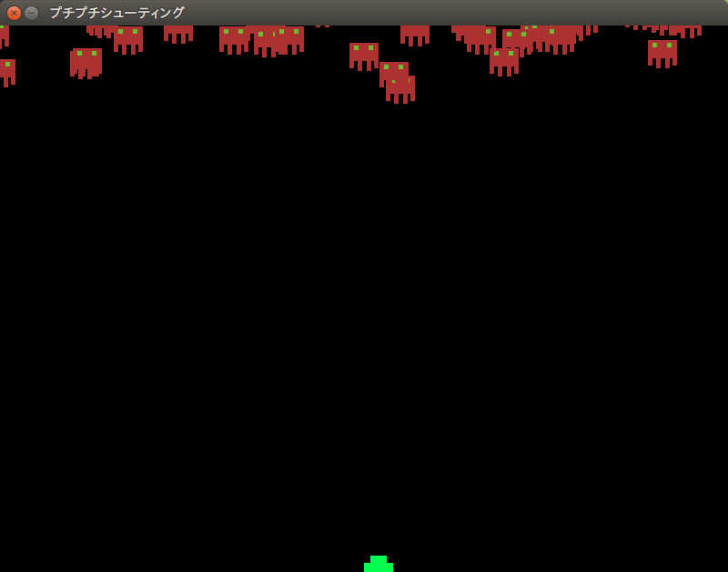

「こいつら、動くぞ？！」 - 敵を表示させて動かしてみる。
--------------------------------------------------------------

大半のゲームには何らかの課題が在ります。モンスターを倒したり宇宙人を侵入させないようにしたり。
ということで敵を出しましょう。

.. image:: img/enemy_img.png
   :alt: よろしい、ならばせんそうだ

あっ！　重要なことを忘れてた！　ゲームにはルールが必要です。
ということで今ここでこのゲームのルールを決めちゃいましょう！　いやー、危なかった。

+ プレイヤーは画面下に向かって行く敵をひたすら倒す。
+ 弾は真上にしか打てない
+ 敵とプレイヤーキャラクターがぶつかったらゲームオーバー
+ 敵を画面下から通してしまってもゲームオーバー
+ 敵は気まぐれなので下方向に一直線に進まない
+ 敵の倒して得点がもらえる

ということで、ここでは敵を動かすついでに、ぶつかった時の処理を書きましょう。

さてさて、ここでソースコードが大きく変わりますよ。
筆者も本気出すよ。

.. code-block:: python
    :linenos:

    import pygame, math
    from pygame.locals import *
    import random
    import sys
    import re

    SCR_RECT = Rect(0, 0, 800, 600) # スクリーンサイズ(px指定)

    class Game:
        """
        ゲームの構成そのものをまとめたクラス

        .. tip::

          クラス化することで各メソッドで共通して使う変数にアクセスしやすくする。
        """
        enemy_prob = 12 #敵の出現率

        def __init__(self):
            """
            各種読み込み.
            """
            pygame.init()
            screen = pygame.display.set_mode(SCR_RECT.size)
            pygame.display.set_caption('プチプチシューティング')
            # 素材のロード
            self.load_images()
            # ゲームオブジェクトを初期化
            self.init_game()
            # メインループ開始
            clock = pygame.time.Clock()
            while True:
                clock.tick(60)
                self.update()
                self.draw(screen)
                pygame.display.update()
                self.key_handler()

        def init_game(self):
            """
            ゲームオブジェクトを初期化
            """
            # スプライトグループを作成して登録
            self.all_sprite = pygame.sprite.RenderUpdates()
            self.pc = pygame.sprite.Group() # HACK: 違和感あるけど、プレイヤーキャラクターグループ
            self.enemies = pygame.sprite.Group() # エネミーグループ
            # デフォルトスプライトグループを登録
            Player.containers = self.all_sprite, self.pc
            Enemy.containers = self.all_sprite, self.enemies
            # プレイヤーを作成
            self.player = Player()

        def update(self):
            """
            情報の更新と敵の出現管理
            """
            # 0からenemy_probまでの乱数を出して、0が出たらエネミー出現
            # つまりこのクラスの変数enemy_probを大きくすると……
            if not random.randrange(self.enemy_prob):
                Enemy()
            self.all_sprite.update()
            self.collision_detection()

        def draw(self, screen):
            """
            描画
            """
            screen.fill((0, 0, 0))
            self.all_sprite.draw(screen)

        def collision_detection(self):
            """
            衝突判定

            プレイヤーとエネミー、レーザーとエネミーの衝突判定を行う
            """
            player_collided = pygame.sprite.groupcollide(self.enemies, self.pc, True, True)
            for enemy in player_collided.keys():
                # FIXME: 仮実装。ゲームオーバー画面を本当は出すよ。
                pygame.quit()
                sys.exit()

        def load_images(self):
            """
            各イメージの読み込み
            """
            # スプライトの画像を登録
            Player.image = load_image("pc_img.png")
            Enemy.image = load_image("enemy_img.png")

        def key_handler(self):
            for event in pygame.event.get():
                if event.type == QUIT:
                    pygame.quit()
                    sys.exit()
                elif event.type == KEYDOWN:
                    if event.key == K_ESCAPE:
                        pygame.quit()
                        sys.exit()

    class Player(pygame.sprite.Sprite):
        """
        プレイヤークラス
        """
        speed = 3 # 移動速度

        def __init__(self):
            pygame.sprite.Sprite.__init__(self, self.containers)
            self.rect = self.image.get_rect()
            self.rect.bottom = SCR_RECT.bottom #プレイヤーは画面の一番下からスタート
            self.rect.left = 400
        def update(self):
            pressed_key = pygame.key.get_pressed()
            if pressed_key[K_UP]:
                self.rect.move_ip(0, -self.speed)
            if pressed_key[K_RIGHT]:
                self.rect.move_ip(self.speed, 0)
            if pressed_key[K_DOWN]:
                self.rect.move_ip(0, self.speed)
            if pressed_key[K_LEFT]:
                self.rect.move_ip(-self.speed, 0)
            # 画面からはみ出さないようにする
            self.rect = self.rect.clamp(SCR_RECT)

    class Enemy(pygame.sprite.Sprite):
        """
        エネミークラス
        """
        speed = 3 # 移動速度

        def __init__(self):
            """
            初期化処理

            .. note::
              敵は上からランダムに出てきます。
            """
            pygame.sprite.Sprite.__init__(self, self.containers)
            self.rect = self.image.get_rect()
            self.rect.left = random.randrange(SCR_RECT.width - self.rect.width)
            self.rect.bottom = SCR_RECT.top

        def update(self):
            """
            更新処理

            .. note::
              ランダムで動き回ります。
            """
            mov_vec = [(-self.speed, 0), (0, self.speed), (self.speed, 0), (0, -self.speed)] # 上, 右, 下, 左の順で指定。
            self.rect.move_ip(random.choice(mov_vec))

    def load_image(filename, colorkey=None):
        """
        画像をロードする。

        @param filename ファイル名（ディレクトリ含む）
        @param colorkey 背景色 (デフォルト値 None)
        @return pygame.surface.Surface
        """
        # 画像ファイルがpngかgifか判定するための正規表現
        filecase = re.compile(r'[a-zA-Z0-9_/]+\.png|[a-zA-Z0-9_/]+\.gif')

        try:
            image = pygame.image.load(filename)
        except pygame.error as message:
            print("Cannot load image: " + filename)
            raise SystemExit from message

        # 画像の拡張子によって処理を振り分け
        is_match = filecase.match(filename)
        if is_match:
            image = image.convert_alpha()
        else:
            image = image.convert()

        if colorkey is not None:
            if colorkey is -1:
                colorkey = image.get_at((0, 0))
            image.set_colorkey(colorkey, RLEACCEL)
        return image

    if __name__ == '__main__':
        Game()

激変したこのソースコード。

色々新しい要素が追加されたので説明していきますね。

.. code-block:: python
  :lineno-start: 43

  # スプライトグループを作成して登録
  self.all_sprite = pygame.sprite.RenderUpdates()
  self.pc = pygame.sprite.Group() # HACK: 違和感あるけど、プレイヤーキャラクターグループ
  self.enemies = pygame.sprite.Group() # エネミーグループ
  # デフォルトスプライトグループを登録
  Player.containers = self.all_sprite, self.pc
  Enemy.containers = self.all_sprite, self.enemies

当たり判定をするにはとてつもなく大切なのがこの ``pygame.sprite.Group()`` なんです。
これはゲームの中の色んなスプライトをひとまとめにして動かすのに便利なクラスなのです。
また、これを使って当たり判定を行うため、これがないことには「ぶつかったら」という処理が書けないと言っても
過言じゃないです。

.. note::
    きっとRectクラスとGroupの中に入っているスプライトのRectでも当たり判定ができるだろうけど、
    そこまで頭が回らなかった。興味あるNinjaは調べてやってみて。

.. code-block:: python
  :lineno-start: 163

  # 画像ファイルがpngかgifか判定するための正規表現
  filecase = re.compile(r'[a-zA-Z0-9_/]+\.png|[a-zA-Z0-9_/]+\.gif')

これ、気になった？　筆者はそういうNinjaが好きだよ。（だけど興味が無くってもそれは普通だよ）

これは **正規表現（せいきひょうげん）** という、文字列のフィルターだと思ってくれると良い。

この正規表現というやつは、はじめはものすごく難解な呪文に見えるけど、勉強すればするほど、とっても便利な代物さ。

詳しい解説は省くけど、これは見たらちょっとわかるかもしれない。 *png* か *gif* という文字が入る文字列を
フィルタリングするんだ。このフィルタをどう使っているかというと……、

.. code-block:: python
  :lineno-start: 171

  # 画像の拡張子によって処理を振り分け
  is_match = filecase.match(filename)
  if is_match:
      image = image.convert_alpha()
  else:
      image = image.convert()

こんな風に *ファイル名にpngかgifが入っているファイル* かどうか区別するために使っているんだ。

さて、説明はこれくらいにして、実際に実行してみるとどうなるのか見てみよう。

ぞろぞろやってくる敵さんが上から攻めて来たぞ!

正直なことを言うと、敵さんが画面下についてもゲームオーバーにならないけど、
君の操作するキャラクターが囲まれるのは時間の問題だ！

そして今の君には奴らに対抗する手段は、画面の中をうろうろするしかない！
これはやばい！
