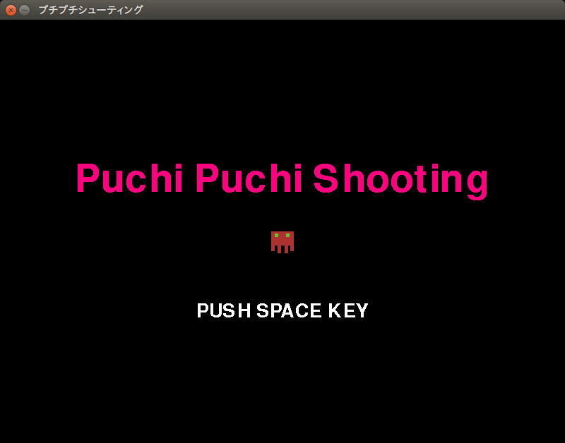
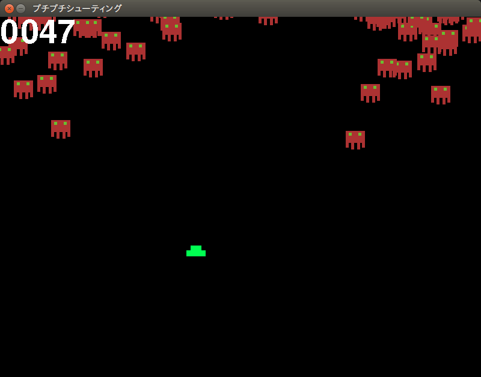
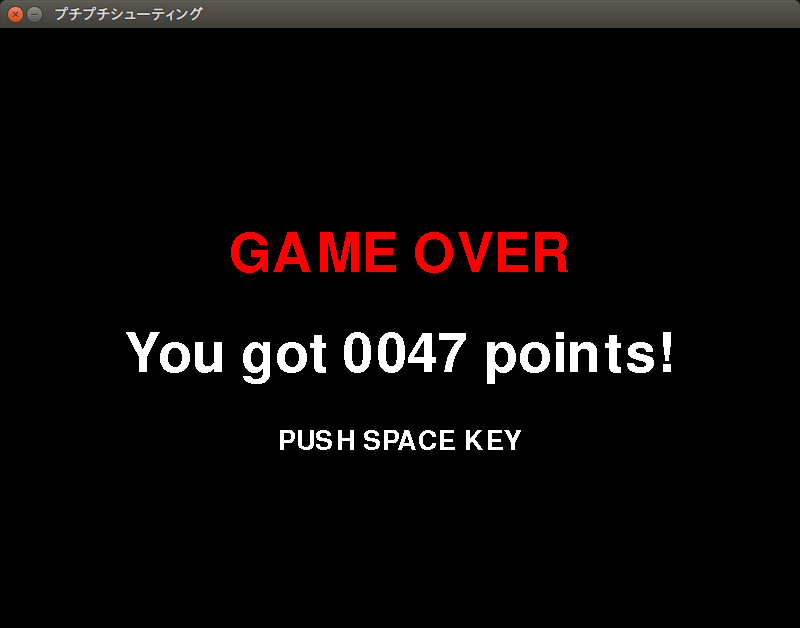

色々ゲームにする。 - タイトル画面・ゲームオーバー画面・得点表示
-------------------------------------------------------------------

まえがき
````````````````````````
さて、ここまで作ったゲーム。何か色々足りないと思わないか？

筆者はねえ、「タイトル画面」と「ゲームオーバー画面」と「得点表示」が無いことに気づいちゃったんだよ。

ということでここからは全力疾走で実装していくぞ、皆ついてこれるかな？

ソースコード
````````````````````````

.. code-block:: python
    :linenos:

    import pygame, math
    from pygame.locals import *
    import random
    import sys
    import re

    GAME_MODE = {'START': 0, 'PLAY': 1, 'GAMEOVER': 2}
    SCR_RECT = Rect(0, 0, 800, 600) # スクリーンサイズ(px指定)

    class Game:
        """
        ゲームの構成そのものをまとめたクラス

        .. tip::

          クラス化することで各メソッドで共通して使う変数にアクセスしやすくする。
        """
        enemy_prob = 12 #敵の出現率

        def __init__(self):
            """
            各種読み込み.
            """
            pygame.init()
            screen = pygame.display.set_mode(SCR_RECT.size)
            pygame.display.set_caption('プチプチシューティング')
            # 素材のロード
            self.load_images()
            # ゲームオブジェクトを初期化
            self.init_game()
            # メインループ開始
            clock = pygame.time.Clock()
            while True:
                clock.tick(60)
                self.update()
                self.draw(screen)
                pygame.display.update()
                self.key_handler()

        def init_game(self):
            """
            ゲームオブジェクトを初期化
            """
            # ゲームの状態
            self.game_state = GAME_MODE['START']
            # スプライトグループを作成して登録
            self.all_sprite = pygame.sprite.RenderUpdates()
            self.pc = pygame.sprite.Group() # HACK: 違和感あるけど、プレイヤーキャラクターグループ
            self.enemies = pygame.sprite.Group() # エネミーグループ
            self.razors = pygame.sprite.Group() # レーザーグループ
            # デフォルトスプライトグループを登録
            Player.containers = self.all_sprite, self.pc
            Enemy.containers = self.all_sprite, self.enemies
            Razor.containers = self.all_sprite, self.razors
            # プレイヤーを作成
            self.player = Player()
            # スコア初期化
            self.score = 0

        def update(self):
            """
            情報の更新と敵の出現管理
            """
            if self.game_state == GAME_MODE['PLAY']:
                # 0からenemy_probまでの乱数を出して、0が出たらエネミー出現
                # つまりこのクラスの変数enemy_probを大きくすると……
                if not random.randrange(self.enemy_prob):
                    Enemy()
                self.all_sprite.update()
                self.collision_detection()

        def draw(self, screen):
            """
            描画
            """
            screen.fill((0, 0, 0))
            if self.game_state == GAME_MODE['START']:
                # タイトル画面描画
                title_font = pygame.font.SysFont(None, 80)
                title = title_font.render('Puchi Puchi Shooting', False, (255, 0, 128))
                screen.blit(title, ((SCR_RECT.width - title.get_width()) / 2, 200))
                # エネミーのみ描画
                enemy_image = Enemy.image
                screen.blit(enemy_image, ((SCR_RECT.width - enemy_image.get_width())/ 2, 300))
                # PUSH SPACE KEYを描画
                push_font = pygame.font.SysFont(None, 40)
                push_space = push_font.render("PUSH SPACE KEY", False, (255, 255, 255))
                screen.blit(push_space, ((SCR_RECT.width - push_space.get_width()) / 2, 400))
                # クレジット描画
                credit_font = pygame.font.SysFont(None, 20)
                credit = credit_font.render('2017 CoderDojo Sapporo', False, (255, 255, 255))
                screen.blit(credit, ((SCR_RECT.width - credit.get_width()) / 2, 600))

            if self.game_state == GAME_MODE['PLAY']:
                # ゲームプレイ
                self.all_sprite.draw(screen)
                # 得点表示
                score_font = pygame.font.SysFont(None, 80)
                score = score_font.render("{0:0>4d}".format(self.score), False, (255, 255, 255))
                screen.blit(score, (SCR_RECT.left, SCR_RECT.top))

            if self.game_state == GAME_MODE['GAMEOVER']:
                # GAME OVERを描画
                gameover_font = pygame.font.SysFont(None, 80)
                gameover = gameover_font.render("GAME OVER", False, (255, 0, 0))
                screen.blit(gameover, ((SCR_RECT.width - gameover.get_width()) / 2, 200))
                # PUSH STARTを描画
                push_font = pygame.font.SysFont(None, 40)
                push_space = push_font.render("PUSH SPACE KEY", False, (255, 255, 255))
                screen.blit(push_space, ((SCR_RECT.width - push_space.get_width()) / 2, 400))
                # 得点表示
                score_font = pygame.font.SysFont(None, 80)
                score = score_font.render("You got {0:0>4d} points!".format(self.score), False, (255, 255, 255))
                screen.blit(score, ((SCR_RECT.width - score.get_width()) / 2, 300))

        def collision_detection(self):
            """
            衝突判定

            プレイヤーとエネミー、レーザーとエネミーの衝突判定を行う
            """
            player_collided = pygame.sprite.groupcollide(self.enemies, self.pc, True, True)
            for enemy in player_collided.keys():
                self.game_state = GAME_MODE["GAMEOVER"]

            razor_collided = pygame.sprite.groupcollide(self.enemies, self.razors, True, True)
            for razor in razor_collided.keys():
                self.score += 1


        def load_images(self):
            """
            各イメージの読み込み
            """
            # スプライトの画像を登録
            Player.image = load_image("pc_img.png")
            Enemy.image = load_image("enemy_img.png")
            Razor.image = load_image("lazer.png")

        def key_handler(self):
            for event in pygame.event.get():
                if event.type == QUIT:
                    pygame.quit()
                    sys.exit()
                elif event.type == KEYDOWN and event.key == K_ESCAPE:
                    pygame.quit()
                    sys.exit()
                elif event.type == KEYDOWN and event.key == K_SPACE:
                    if self.game_state == GAME_MODE['START']: # スタート画面でスペースキーを押したらスタート
                        self.game_state = GAME_MODE['PLAY']
                    elif self.game_state == GAME_MODE['GAMEOVER']: # ゲームオーバー
                        self.init_game() #ゲームを初期化して再開
                        self.game_state = GAME_MODE['PLAY']


    class Player(pygame.sprite.Sprite):
        """
        プレイヤークラス
        """
        speed = 3 # 移動速度
        charge = 15 # レーザーがチャージされるまでの時間

        def __init__(self):
            pygame.sprite.Sprite.__init__(self, self.containers)
            self.rect = self.image.get_rect()
            self.rect.bottom = SCR_RECT.bottom #プレイヤーは画面の一番下からスタート
            self.rect.left = 400
            self.charge_timer = 0
        def update(self):
            pressed_key = pygame.key.get_pressed()
            if pressed_key[K_UP]:
                self.rect.move_ip(0, -self.speed)
            if pressed_key[K_RIGHT]:
                self.rect.move_ip(self.speed, 0)
            if pressed_key[K_DOWN]:
                self.rect.move_ip(0, self.speed)
            if pressed_key[K_LEFT]:
                self.rect.move_ip(-self.speed, 0)
            # 画面からはみ出さないようにする
            self.rect = self.rect.clamp(SCR_RECT)

            if pressed_key[K_SPACE]:
                # リロード時間が0になるまで発射できない。
                if self.charge_timer > 0:
                    # リロード中
                    self.charge_timer -= 1
                else:
                    # 発射！
                    Razor(self.rect.center)# 作成すると同時にall_spriteに追加される。
                    self.charge_timer = self.charge


    class Enemy(pygame.sprite.Sprite):
        """
        エネミークラス
        """
        speed = 3 # 移動速度

        def __init__(self):
            """
            初期化処理

            .. note::
              敵は上からランダムに出てきます。
            """
            pygame.sprite.Sprite.__init__(self, self.containers)
            self.rect = self.image.get_rect()
            self.rect.left = random.randrange(SCR_RECT.width - self.rect.width)
            self.rect.bottom = SCR_RECT.top

        def update(self):
            """
            更新処理

            .. note::
              ランダムで動き回ります。
            """
            mov_vec = [(-self.speed, 0), (0, self.speed), (self.speed, 0), (0, -self.speed)] # 上, 右, 下, 左の順で指定。
            self.rect.move_ip(random.choice(mov_vec))


    class Razor(pygame.sprite.Sprite):
        """
        レーザークラス

        エネミーへの唯一の武器
        """

        speed = 9 # レーザーの移動速度

        def __init__(self, pos):
            """
            初期化処理
            """
            pygame.sprite.Sprite.__init__(self, self.containers)
            self.rect = self.image.get_rect()
            self.rect.center = pos

        def update(self):
            self.rect.move_ip(0, -self.speed) # 上へ移動
            if self.rect.top < 0: # 上辺に達したら削除
                self.kill()


    def load_image(filename, colorkey=None):
        """
        画像をロードする。

        @param filename ファイル名（ディレクトリ含む）
        @param colorkey 背景色 (デフォルト値 None)
        @return pygame.surface.Surface
        """
        # 画像ファイルがpngかgifか判定するための正規表現
        filecase = re.compile(r'[a-zA-Z0-9_/]+\.png|[a-zA-Z0-9_/]+\.gif')

        try:
            image = pygame.image.load(filename)
        except pygame.error as message:
            print("Cannot load image: " + filename)
            raise SystemExit from message

        # 画像の拡張子によって処理を振り分け
        is_match = filecase.match(filename)
        if is_match:
            image = image.convert_alpha()
        else:
            image = image.convert()

        if colorkey is not None:
            if colorkey is -1:
                colorkey = image.get_at((0, 0))
            image.set_colorkey(colorkey, RLEACCEL)
        return image


    if __name__ == '__main__':
        Game()

解説
`````````

久々に全力疾走で実装したので、頭が息切れ起こしてるけど、ちゃんと解説するよ。

今回一番上に追加したこれ。

.. code-block:: python
    :lineno-start: 7

    GAME_MODE = {'START': 0, 'PLAY': 1, 'GAMEOVER': 2}

これは **辞書型（じしょがた）** というデータ形式でこれを上手く使いこなせると、
数字ばっかりで制御しているプログラムの見通しが大分良くなるよ。

| え？
| 「じゃあ文字で判定すればいいじゃないか」
| って？

甘い！　某雪のマークのコーヒー並に甘い！

そのやり方には2つ問題がある。一つは *文字を打ち間違えた時が面倒くさい* という理由。
もうひとつは **コンピューターは文字の比較がむちゃくちゃ苦手** という点だ。

もっとも、最近のコンピューターは人間の音声を解釈してそれに対してリアルタイムで返答するくらいには、
一見性能が上がっているが、その裏では文字列をコンピューターの中の文字の表から数字に直して、その数字で
比較して……という、人間でも地味に面倒くさい事をやっている。

ましてや音声となれば……ああ、まあ、こういうムダ話はここじゃなくて近くのメンターさんに聞いたほうがいいかもね。
そもそも、実のこと言うとこのやり方が唯一無二で正しいという保証もどこにもない。

閑話休題（かんわきゅうだい）

今回追加した ``GAME_MODE`` 辞書を利用して、Gameクラスの中で動作を色々操ってるわけだね。

-------------------------------------------------

そういえばここにきてやっと文字の表示ですよ。Ninja諸君。

メンターさんがNinjaと同じくらいの歳の頃は、ターミナルやコマンドプロンプトの画面に *Hello world* って
表示するのが初めてのプログラミングでなあ……え？　昔話はいいって？

真面目な話、今そんなことを最初にできたところで、「つまらない」と思われると、この記事を書いてるメンターは悲しくなるから、
いきなり画像を表示させたりしてみたわけですよ。

.. note::
    Pythonではターミナルとかの画面に文字を表示するのは、::
        print('Hello, world!')

    って打つだけ。ね？　簡単でしょ？

そういえばその文字表示に関しての解説ね。

.. code-block:: python
    :lineno-start: 97

    # 得点表示
    score_font = pygame.font.SysFont(None, 80)
    score = score_font.render("{0:0>4d}".format(self.score), False, (255, 255, 255))
    screen.blit(score, (SCR_RECT.left, SCR_RECT.top))

特に特殊な事をやってるように見えるここをあえて抽出。

98行目は、フォント（書体）をゲームの中で使えるように読み込んでいる処理。

99行目が一番やっかいだね。これは文字起こしをしているわけだけど、また謎の呪文見たいのが出てきたと思ってる？

``"{0:0>4d}".format(self.score)`` は何をやっているかというと、これもコンピューターに通じる言葉で、
フォーマット（書式ともいう）を指定している。詳しく見てみよう。

| ``{0}`` と書くだけで、その後ろの ``format(self.score)`` と関連付けして、
| 「self.scoreを文字列にして表示しなさい」
| という指示になる。

| ここにさらに ``:0>4d`` と書くことで
| 「0で4つ埋めた表示にしなさい」
| って指示をしているわけだ。

この辺り詳しく知りたい人は、Pythonの公式ドキュメントの `6.1.3. 書式指定文字列の文法`_ を見るといいよ。

.. _`6.1.3. 書式指定文字列の文法`: http://docs.python.jp/3/library/string.html#formatspec

ゲーム画面
````````````````````

ということで、早速出来上がったゲーム画面を見てみよう。



お、



おおぉ！



おおぅ！

画像で見ても感動が伝わらないので、ぜひNinja諸君には自身でコーディングしてこの感動を味わって欲しい！
