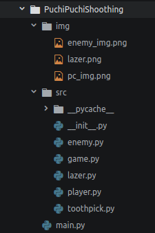

最後の大掃除 - ソースを綺麗に、分割しちゃうぞ！
-------------------------------------------------

まえがき
```````````

ところでさ。ここまでのソースコード、まだ短い方といえば短い方なんだけど、色々詰まり過ぎてる気がするのは、
この文章を書いているメンターだけですかね？

ということで、ここからは正直おまけっぽくなってしまいますが、ソースコードをバラバラにしちゃいます。

クラスごとにバラバラにする。
```````````````````````````````````````

割と鉄則ですが、まずはクラスごとにファイルを分けましょう。

今回は全部で以下のクラスができましたね。

Game
  今回、ゲーム全体を司るクラス。

Player
  名前の通り、プレイヤーキャラクターを制御するクラス。

Enemy
  名前の通り、エネミーキャラクターを制御するクラス

Razor
  レーザーのクラス

load_image
  イメージを読み込むのに使った関数

じゃあこれらをとりあえず別々のファイルにします。

が、単純にバラバラにすると、プログラムが動かなくなるのは当然の話なので、

**そのクラスや機能では、何を使っているか** *どのライブラリやモジュールを使っているか* を把握しつつ分解していきます。
もちろん、分解したコードには、必要なライブラリやモジュールのインポートを忘れずに！

ということで、自分の手元では以下の様にバラバラになりました。

+ game.py
+ player.py
+ enemy.py
+ lazer.py
+ toothpick.py
+ main.py

.. caution::
    しれっと *Razor* とスペルミスしてるのを *lazer* と直してます。

    そしてload_image関数は ``toothpick.py`` ファイルに移しました。

ちなみに ``main.py`` の中身ですが、現段階では::
    if __name__ == '__main__':
        Game()

となってます。



フォルダ構成がこのようになっていれば大丈夫です。


バラバラにしたファイルをプログラミングで繋げる
````````````````````````````````````````````````````````

で、これらを一回一つのフォルダに入れてしまいます。今回は ``PuchiPuchiShoothing`` にしておきましょう。
そして更にその下に ``src`` というフォルダを作ります。ここに *main.py以外* のファイルを入れます。

あと今回使っている画像、こちらは ``img`` というフォルダを作って、そこに入れておきましょう。

次に、 ``__init__.py`` というファイルを、``src`` フォルダの中に作ります。中身は空っぽで問題ないです。

さて、ここからバラバラにしたファイル同士をつなげていきましょう。

まず今回の肝となる ``game.py`` の一番上の行に以下を追記します。::
    from . import toothpick, player, enemy, lazor

そして、以下のように変更します。

.. code-block:: python
    :linenos:

    from . import toothpick, player, enemy, lazer
    import pygame
    from pygame.locals import *
    import random
    import sys

    GAME_MODE = {'START': 0, 'PLAY': 1, 'GAMEOVER': 2}
    SCR_RECT = Rect(0, 0, 800, 600) # スクリーンサイズ(px指定)

    class Game:
        """
        ゲームの構成そのものをまとめたクラス

        .. tip::

          クラス化することで各メソッドで共通して使う変数にアクセスしやすくする。
        """
        enemy_prob = 12 #敵の出現率

        def __init__(self):
            """
            各種読み込み.
            """
            pygame.init()
            screen = pygame.display.set_mode(game.SCR_RECT.size)
            pygame.display.set_caption('プチプチシューティング')
            # 素材のロード
            self.load_images()
            # ゲームオブジェクトを初期化
            self.init_game()
            # メインループ開始
            clock = pygame.time.Clock()
            while True:
                clock.tick(60)
                self.update()
                self.draw(screen)
                pygame.display.update()
                self.key_handler()

        def init_game(self):
            """
            ゲームオブジェクトを初期化
            """
            # ゲームの状態
            self.game_state = game.GAME_MODE['START']
            # スプライトグループを作成して登録
            self.all_sprite = pygame.sprite.RenderUpdates()
            self.pc = pygame.sprite.Group() # HACK: 違和感あるけど、プレイヤーキャラクターグループ
            self.enemies = pygame.sprite.Group() # エネミーグループ
            self.lazers = pygame.sprite.Group() # レーザーグループ
            # デフォルトスプライトグループを登録
            player.Player.containers = self.all_sprite, self.pc
            enemy.Enemy.containers = self.all_sprite, self.enemies
            lazer.Lazer.containers = self.all_sprite, self.lazers
            # プレイヤーを作成
            self.player = player.Player()
            # スコア初期化
            self.score = 0

        def update(self):
            """
            情報の更新と敵の出現管理
            """
            if self.game_state == game.GAME_MODE['PLAY']:
                # 0からenemy_probまでの乱数を出して、0が出たらエネミー出現
                # つまりこのクラスの変数enemy_probを大きくすると……
                if not random.randrange(self.enemy_prob):
                    enemy.Enemy()
                self.all_sprite.update()
                self.collision_detection()

        def draw(self, screen):
            """
            描画
            """
            screen.fill((0, 0, 0))
            if self.game_state == GAME_MODE['START']:
                # タイトル画面描画
                title_font = pygame.font.SysFont(None, 80)
                title = title_font.render('Puchi Puchi Shooting', False, (255, 0, 128))
                screen.blit(title, ((SCR_RECT.width - title.get_width()) / 2, 200))
                # エネミーのみ描画
                enemy_image = enemy.Enemy.image
                screen.blit(enemy_image, ((SCR_RECT.width - enemy_image.get_width())/ 2, 300))
                # PUSH SPACE KEYを描画
                push_font = pygame.font.SysFont(None, 40)
                push_space = push_font.render("PUSH SPACE KEY", False, (255, 255, 255))
                screen.blit(push_space, ((SCR_RECT.width - push_space.get_width()) / 2, 400))
                # クレジット描画
                credit_font = pygame.font.SysFont(None, 20)
                credit = credit_font.render('2017 CoderDojo Sapporo', False, (255, 255, 255))
                screen.blit(credit, ((SCR_RECT.width - credit.get_width()) / 2, 600))

            if self.game_state == GAME_MODE['PLAY']:
                # ゲームプレイ
                self.all_sprite.draw(screen)
                # 得点表示
                score_font = pygame.font.SysFont(None, 80)
                score = score_font.render("{0:0>4d}".format(self.score), False, (255, 255, 255))
                screen.blit(score, (SCR_RECT.left, SCR_RECT.top))

            if self.game_state == GAME_MODE['GAMEOVER']:
                # GAME OVERを描画
                gameover_font = pygame.font.SysFont(None, 80)
                gameover = gameover_font.render("GAME OVER", False, (255, 0, 0))
                screen.blit(gameover, ((SCR_RECT.width - gameover.get_width()) / 2, 200))
                # PUSH STARTを描画
                push_font = pygame.font.SysFont(None, 40)
                push_space = push_font.render("PUSH SPACE KEY", False, (255, 255, 255))
                screen.blit(push_space, ((SCR_RECT.width - push_space.get_width()) / 2, 400))
                # 得点表示
                score_font = pygame.font.SysFont(None, 80)
                score = score_font.render("You got {0:0>4d} points!".format(self.score), False, (255, 255, 255))
                screen.blit(score, ((SCR_RECT.width - score.get_width()) / 2, 300))

        def collision_detection(self):
            """
            衝突判定

            プレイヤーとエネミー、レーザーとエネミーの衝突判定を行う
            """
            player_collided = pygame.sprite.groupcollide(self.enemies, self.pc, True, True)
            for enemy in player_collided.keys():
                self.game_state = GAME_MODE["GAMEOVER"]

            lazer_collided = pygame.sprite.groupcollide(self.enemies, self.lazers, True, True)
            for lazer in lazer_collided.keys():
                self.score += 1


        def load_images(self):
            """
            各イメージの読み込み
            """
            # スプライトの画像を登録
            player.Player.image = toothpick.load_image("img/pc_img.png")
            enemy.Enemy.image = toothpick.load_image("img/enemy_img.png")
            lazer.Lazer.image = toothpick.load_image("img/lazer.png")

        def key_handler(self):
            for event in pygame.event.get():
                if event.type == QUIT:
                    pygame.quit()
                    sys.exit()
                elif event.type == KEYDOWN and event.key == K_ESCAPE:
                    pygame.quit()
                    sys.exit()
                elif event.type == KEYDOWN and event.key == K_SPACE:
                    if self.game_state == GAME_MODE['START']: # スタート画面でスペースキーを押したらスタート
                        self.game_state = GAME_MODE['PLAY']
                    elif self.game_state == GAME_MODE['GAMEOVER']: # ゲームオーバー
                        self.init_game() #ゲームを初期化して再開
                        self.game_state = GAME_MODE['PLAY']

さーて、これで動くかなぁ……、 ``python main.py`` で動かしてみよう！

……動かないんですよ。

ここからちょっとハードモード。ゲームを実行してみた時のエラーメッセージを頼りに、プログラムを変更してみよう！
ここまでこれたNinjaならできるだろうとおもうのだが、辛かったら周りのNinjaやメンターさんに遠慮無く声掛けするといいよ！

.. note::
    感のいいNinjaなら、Pythonのエラーの一言で複数の変更箇所を見つけられるかもね。

おおっと、油断しないで、ウィンドウが表示されたからと言って、全てが動くわけじゃないぞ！

.. hint::
    キーボード入力の処理は、実は以下のライブラリが受け取っている。::
        from pygame.locals import *

正解はあえて見せない。もし分解する前と同じように動いていればそれが一つの正解だからだ。


で、何が嬉しいの？
```````````````````````

一見バラバラにして手間が増えたように思えるが、これは責任分散というアプローチでもあり、モジュールやクラスを
別のプロジェクトなどでも扱いやすくするためなのである。

一つのファイルにまとめていると、一つを見ればいいかもしれないが、もっと規模の大きなゲームを作るとなると、おそらく
ソースコードの行数は10万行以上になるだろう。　そのコードのどこに何があるかを把握できるほど人間は上手く出来てる人は居ない。

また、一つのコードにまとめて全部書いていると、エディタで開けない可能性があるという致命的な問題がある。

なので、修正箇所をわかりやすく、かつパソコンにも優しくできるという意味では、ソースコードの分割は有用なのだ。

それと、分解したことで、例えば今回だと``toothpick.py`` は、新しいゲームを作るときにファイルをコピーしてしまえば、
簡単に流用可能なのだ。

ただ、流用しやすくするためには、本当はしっかりとソースコードにコメントを書いて、どんな機能があり、どのように使うか、
と言ったことをしっかり書いておくと、他の人（もしくは **3日後の自分** がそのプログラムを使うときに助かるので、
ちゃんと使い方くらいは書いておこう。
